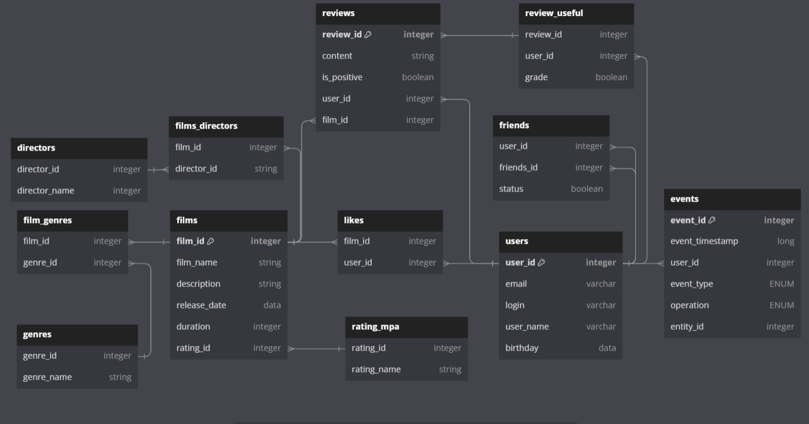

# java-filmorate
Ниже представлена схема БД к проекту FilmoRate. БД состоит из 2 основных таблиц (Users и Films) и нескольких дополнительных таблиц, которые устанавливают связь между основными таблицами или являются вспомогательными для нормализации БД.

[Схема БД к проекту Filmorate.](https://dbdiagram.io/d/64a9e50502bd1c4a5ebb4f02)

